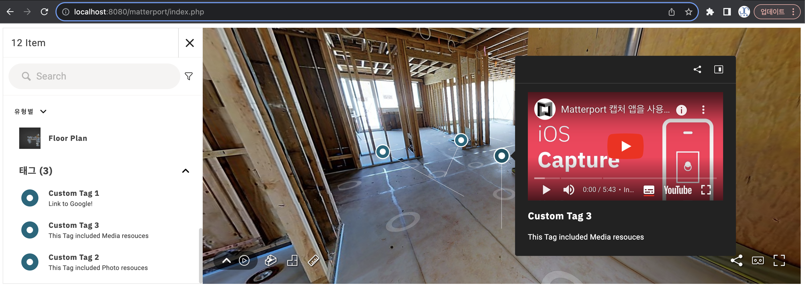

  # MatterPort SDK 사용 예제 (https://matterport.github.io/showcase-sdk/index.html)
  
  

  ## 본 프로젝트는 MatterPort에서 제공하는 FREE Trial (localhost 도메인 한정) SDK Key를 통해 수행 되었음

  # Config파일은 PHP 파일이며, API Key관리를 위해 상수 선언되어있음
  code define('MATTERPORT_KEY', "[YOUR_SDK_KEY]");
  code define('MODEL_ID', "[YOUR_MODEL_KEY]");

  